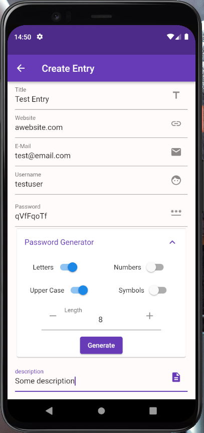
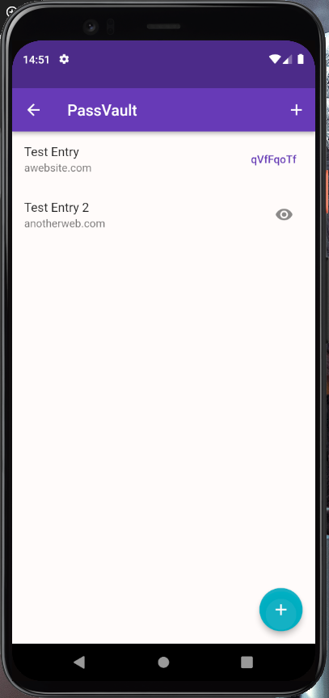
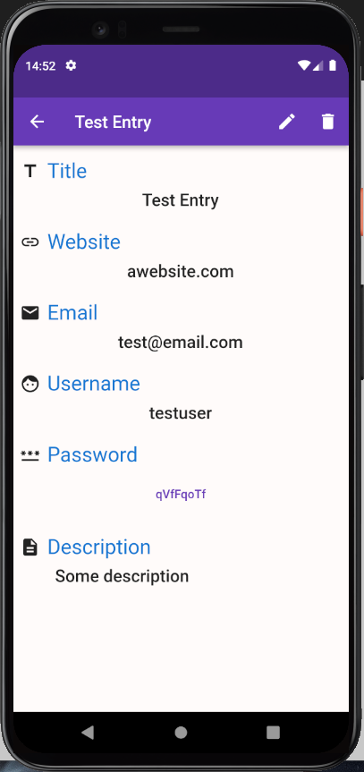

# Pass Vault

This Flutter application is made for the purpose of storing passwords securely. Created by Aryan Akbarpour (aryan.akr@yahoo.com)

## Description

In this application, the user can create password entries (which include  title, website, username, email, password and description). Upon creating an entry, these values are encripted and the encrypted password is stored in Keychain  for IOS and AES encryption is used for android (AES secret key is encrypted with RSA and stored in KeyStore).

When the application is launched, the user must either enter the password set at the first launch of the application or use the biometric authentication.

**Currently this application is only made and tested for Android devices.**

## Screenshots

<table>
  <tr>
     <td>Create Entry Page</td>
     <td>Entries List Page</td>
     <td>Entry Detail Page</td>
  </tr>
  <tr>
    <td></td>
    <td></td>
    <td></td>
  </tr>
 </table>
